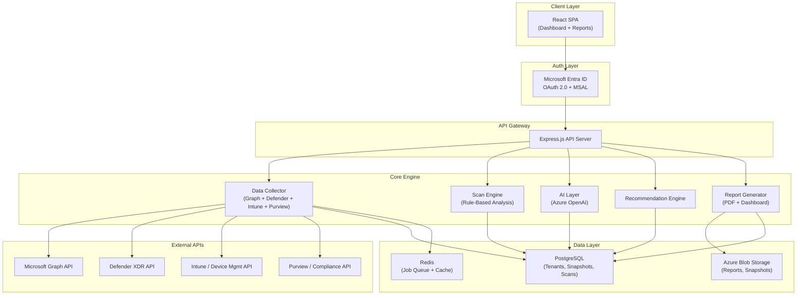
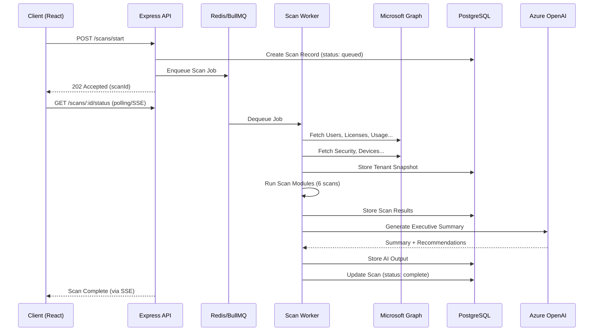
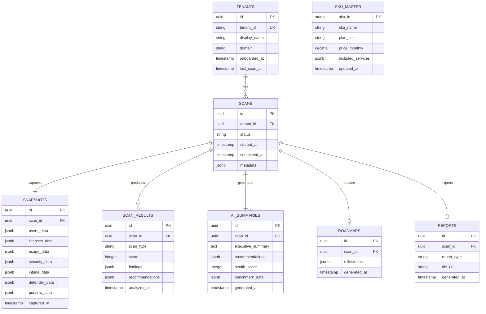
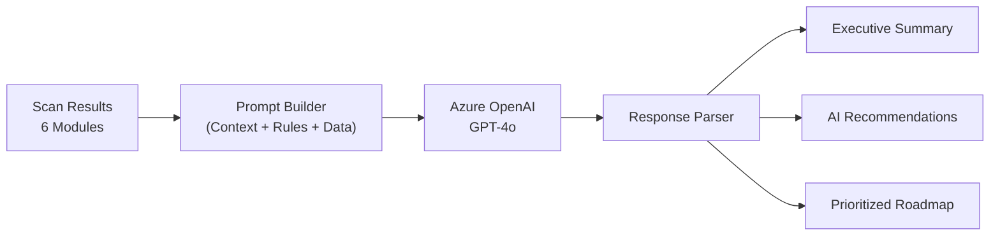
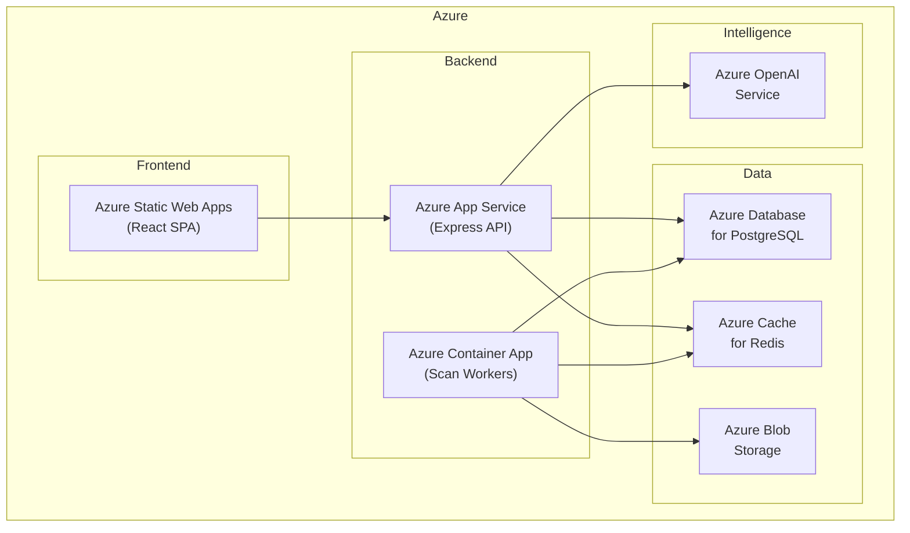

# M365 Tenant Advisor — Architecture Proposal

## 1. High-Level System Architecture



---

## 2. Architecture Pattern: **Event-Driven Scan Pipeline**

I'm choosing a **pipeline architecture** over a simple request-response model. Here's why:

> Scanning a tenant takes time — you're hitting 15+ Microsoft API endpoints, processing thousands of users, devices, and policies. This **cannot** be synchronous.

### The Flow



> [!IMPORTANT]
> **Why this matters:** A single tenant scan could take 30-120 seconds depending on size. Using a job queue (BullMQ + Redis) lets us handle multiple tenants concurrently, retry failed API calls, and give real-time progress updates via Server-Sent Events (SSE).

---

## 3. Tech Stack — My Choices & Rationale

| Layer | Technology | Why |
|-------|-----------|-----|
| **Frontend** | React 18 + Vite | Fast dev experience, ecosystem maturity |
| **Styling** | Tailwind CSS v4 | Rapid UI development, utility-first for dashboards |
| **Charts** | Recharts / Chart.js | Lightweight, React-native charting |
| **Backend** | Node.js + Express | You're comfortable with it; Graph SDK is JS-native |
| **Job Queue** | BullMQ + Redis | Reliable async scan processing with retries |
| **Database** | PostgreSQL | Relational data (tenants, users, licenses), JSONB for flexible scan results |
| **Cache** | Redis | API response caching + session store |
| **Auth** | MSAL.js + Entra ID | Microsoft's official OAuth library |
| **AI** | Azure OpenAI (GPT-4o) | Stays in Azure ecosystem, enterprise compliance |
| **PDF Reports** | Puppeteer / @react-pdf/renderer | Generate professional PDF reports |
| **File Storage** | Azure Blob Storage | Store generated reports, large snapshots |
| **Deployment** | Azure App Service + Azure Container Apps | Natural fit for M365 ecosystem |
| **CI/CD** | GitHub Actions | Automated testing + deployment |

---

## 4. Module Architecture (Backend)

```
src/
├── config/                    # Environment, DB, Redis, Azure configs
│   ├── database.js
│   ├── redis.js
│   ├── azure.js
│   └── microsoft-graph.js
│
├── auth/                      # Microsoft Entra ID OAuth
│   ├── msal-config.js
│   ├── auth.middleware.js
│   └── auth.routes.js
│
├── tenants/                   # Tenant onboarding & management
│   ├── tenant.model.js
│   ├── tenant.service.js
│   └── tenant.routes.js
│
├── collector/                 # Data Collection Engine
│   ├── graph/
│   │   ├── users.collector.js
│   │   ├── licenses.collector.js
│   │   ├── usage.collector.js
│   │   ├── security.collector.js
│   │   └── groups.collector.js
│   ├── intune/
│   │   ├── devices.collector.js
│   │   ├── compliance.collector.js
│   │   └── enrollment.collector.js
│   ├── defender/
│   │   ├── incidents.collector.js
│   │   ├── secureScore.collector.js
│   │   └── vulnerabilities.collector.js
│   ├── purview/
│   │   ├── dlp.collector.js
│   │   ├── retention.collector.js
│   │   └── sensitivityLabels.collector.js
│   └── collector.orchestrator.js   # Runs all collectors in parallel
│
├── scanner/                   # Scan Engine (6 scan modules)
│   ├── license-optimization.scan.js
│   ├── security-gap.scan.js
│   ├── compliance-readiness.scan.js
│   ├── cost-leakage.scan.js
│   ├── identity-risk.scan.js
│   ├── device-endpoint.scan.js
│   ├── scan.orchestrator.js    # Runs all scans, aggregates results
│   └── rules/                  # Rule definitions per scan
│       ├── license.rules.json
│       ├── security.rules.json
│       └── compliance.rules.json
│
├── intelligence/              # AI + Scoring Layer
│   ├── ai-summary.service.js
│   ├── health-score.service.js
│   ├── benchmark.service.js
│   └── prompts/
│       ├── executive-summary.prompt.js
│       └── recommendation.prompt.js
│
├── recommendation/            # Recommendation Engine
│   ├── license.recommender.js
│   ├── security.recommender.js
│   ├── compliance.recommender.js
│   └── roadmap.generator.js
│
├── reports/                   # Report Generation
│   ├── pdf.generator.js
│   ├── templates/
│   │   ├── executive-report.hbs
│   │   └── technical-report.hbs
│   └── report.routes.js
│
├── jobs/                      # Background Job Processing
│   ├── scan.worker.js
│   ├── monthly-report.worker.js
│   └── queue.config.js
│
├── sku-database/              # Own SKU + Pricing Master Data
│   ├── skus.json              # All M365 SKU definitions
│   ├── features-matrix.json   # SKU → Feature mapping
│   ├── pricing.json           # SKU → Price mapping
│   └── sku.service.js
│
└── shared/
    ├── logger.js
    ├── errors.js
    └── graph-client.js        # Reusable Graph API client
```

> [!TIP]
> The `sku-database/` module is **your own maintained database** of Microsoft SKUs, features, and pricing. Microsoft doesn't offer a public pricing API, so you'll curate this from [Microsoft's licensing reference](https://learn.microsoft.com/en-us/entra/identity/users/licensing-service-plan-reference) and update it periodically.

---

## 5. Database Schema (PostgreSQL)



> [!NOTE]
> **Why JSONB columns?** Microsoft API responses are deeply nested and vary by tenant size. Storing raw snapshots as JSONB gives us flexibility to evolve the schema without migrations, while still supporting fast PostgreSQL JSON queries.

---

## 6. Microsoft API Integration Strategy

### Permission Scopes Required (Application Permissions)

```
Microsoft Graph:
├── User.Read.All
├── Directory.Read.All
├── Organization.Read.All
├── Reports.Read.All
├── AuditLog.Read.All
├── Policy.Read.All
├── DeviceManagementManagedDevices.Read.All
├── DeviceManagementConfiguration.Read.All
├── SecurityEvents.Read.All
├── SecurityIncident.Read.All
└── InformationProtectionPolicy.Read.All

Defender:
├── Incident.Read.All
├── Alert.Read.All
└── SecurityRecommendation.Read.All
```

### API Call Strategy

```
Phase 1: Identity & Licensing (parallel)
├── GET /users?$select=id,displayName,assignedLicenses,signInActivity
├── GET /subscribedSkus
├── GET /organization
└── GET /groups?$filter=groupTypes/any(...)

Phase 2: Usage Reports (parallel)
├── GET /reports/getEmailActivityUserDetail
├── GET /reports/getTeamsUserActivityUserDetail
├── GET /reports/getOneDriveUsageAccountDetail
├── GET /reports/getSharePointSiteUsageDetail
└── GET /reports/getOffice365ActiveUserDetail

Phase 3: Security & Compliance (parallel)
├── GET /security/secureScores?$top=1
├── GET /security/incidents
├── GET /identity/conditionalAccess/policies
├── GET /policies/authenticationMethodsPolicy
└── GET /deviceManagement/managedDevices

Phase 4: Intune & Purview (parallel)
├── GET /deviceManagement/deviceCompliancePolicies
├── GET /deviceManagement/deviceConfigurations
└── GET /informationProtection/sensitivityLabels
```

> [!WARNING]
> **Rate Limiting:** Microsoft Graph has throttling limits (~10,000 requests per 10 minutes per app). The collector must implement exponential backoff, request batching (`$batch`), and delta queries for large tenants (1000+ users).

---

## 7. Scan Engine — Rule-Based Architecture

Each scan module follows the same pattern:

```javascript
// Example: license-optimization.scan.js

class LicenseOptimizationScan {
  constructor(snapshot, skuDatabase) {
    this.snapshot = snapshot;
    this.skuDb = skuDatabase;
  }

  analyze() {
    return {
      scanType: 'license-optimization',
      score: this.calculateScore(),
      findings: [
        ...this.detectUnusedLicenses(),
        ...this.detectOverLicensing(),
        ...this.detectUnderLicensing(),
        ...this.detectDisabledUsersWithLicenses(),
        ...this.detectSharedMailboxLicenses(),
      ],
      recommendations: this.generateRecommendations(),
      savings: this.calculateSavings(),
    };
  }

  detectUnusedLicenses() {
    // Users with E5 but only using Exchange + Teams
    // → Recommend E3 or Business Standard
  }

  detectOverLicensing() {
    // Users < 300 with E5 but no Purview/Defender usage
    // → Recommend Business Premium
  }
}
```

### Rule Definition Format

```json
{
  "ruleId": "LIC-001",
  "name": "Unused E5 License Detection",
  "severity": "high",
  "condition": {
    "license": "SPE_E5",
    "unusedServices": ["THREAT_INTELLIGENCE", "INFORMATION_BARRIERS", "LOCKBOX_ENTERPRISE"],
    "minUnusedPercent": 60
  },
  "recommendation": {
    "action": "downgrade",
    "targetSku": "SPE_E3",
    "reason": "User is utilizing less than 40% of E5-exclusive features"
  }
}
```

---

## 8. AI Layer Architecture



### Prompt Engineering Strategy

Rather than dumping raw data into GPT, I'd structure it as:

```
SYSTEM: You are an M365 licensing and security advisor for MSPs.

CONTEXT:
- Tenant: {name}, {userCount} users, {deviceCount} devices
- Current Licenses: {licenseBreakdown}
- Health Score: {score}/100

SCAN FINDINGS:
{structuredFindings}

INSTRUCTIONS:
1. Write a 3-paragraph executive summary for a CTO
2. List top 5 prioritized recommendations
3. Estimate potential annual savings
4. Flag any critical security risks

FORMAT: Respond in JSON with keys: summary, recommendations[], savings, criticalRisks[]
```

> [!TIP]
> **Keep AI costs low** — only call GPT for the executive summary and natural-language recommendations. All scoring, rule matching, and cost calculations should be deterministic (rule-based engine), not AI-driven. AI is the polish layer, not the core logic.

---

## 9. Frontend Architecture

```
frontend/
├── src/
│   ├── pages/
│   │   ├── Dashboard/            # Overview with health score
│   │   ├── LicenseOptimization/  # License scan results
│   │   ├── SecurityAnalysis/     # Security gap findings
│   │   ├── ComplianceReadiness/  # Compliance scan
│   │   ├── CostLeakage/         # Cost waste detection
│   │   ├── IdentityRisk/        # Identity scan
│   │   ├── DeviceEndpoint/      # Device scan
│   │   ├── Recommendations/     # All recommendations
│   │   ├── Roadmap/             # Generated roadmap
│   │   ├── Reports/             # PDF report history
│   │   └── Settings/            # Tenant settings
│   │
│   ├── components/
│   │   ├── ScoreGauge/           # Circular health score
│   │   ├── ScanCard/             # Individual scan summary
│   │   ├── FindingsTable/        # Detailed findings list
│   │   ├── SavingsCalculator/    # Interactive cost widget
│   │   ├── RoadmapTimeline/      # Visual roadmap
│   │   └── ReportPreview/        # PDF preview
│   │
│   ├── hooks/
│   │   ├── useAuth.js
│   │   ├── useScan.js
│   │   └── useTenant.js
│   │
│   └── services/
│       ├── api.js
│       └── auth.js
```

---

## 10. MVP Scope (Phase 1)

Based on your plan, here's what I'd build first:

| Module | MVP | Post-MVP |
|--------|-----|----------|
| Tenant Onboarding | ✅ | |
| Data Collector (Graph) | ✅ | |
| License Optimization Scan | ✅ | |
| Security Gap Analysis | ✅ | |
| Cost Leakage Detection | ✅ | |
| AI Executive Summary | ✅ | |
| Tenant Health Score | ✅ | |
| Dashboard UI | ✅ | |
| PDF Report | ✅ | |
| Compliance Readiness | | ✅ |
| Identity Risk Scan | | ✅ |
| Device & Endpoint Scan | | ✅ |
| Roadmap Generator | | ✅ |
| Industry Benchmarking | | ✅ |
| Monthly Auto-Reports | | ✅ |
| Multi-Tenant Management | | ✅ |

---

## 11. Deployment Architecture



> [!IMPORTANT]
> **Why all-Azure?** Since this product integrates deeply with Microsoft 365, deploying on Azure gives you:
> - Native Entra ID integration
> - Compliance certifications your enterprise clients need
> - Low-latency access to Graph API endpoints
> - Azure OpenAI (data stays in Azure, no external calls)

---

## 12. Key Architectural Decisions Summary

| Decision | Choice | Rationale |
|----------|--------|-----------|
| Sync vs Async Scans | **Async (Job Queue)** | Scans take 30-120s; can't block HTTP requests |
| AI for everything vs Rule-based | **Rule-based core + AI polish** | Deterministic results, low cost, AI only for summaries |
| SQL vs NoSQL | **PostgreSQL with JSONB** | Best of both — relational structure + flexible JSON storage |
| Own SKU DB vs API | **Own curated database** | Microsoft has no public pricing API |
| Monolith vs Microservices | **Modular Monolith (MVP)** | Ship fast, split later if needed |
| Real-time vs Polling | **SSE for scan progress** | Lightweight, no WebSocket overhead |
| Multi-tenant data isolation | **Shared DB, tenant_id column** | Simple for MVP, can shard later |

---

## Open Questions

> [!IMPORTANT]
> **Before we start building, I need clarity on these:**

1. **Target audience** — Are you building this for internal use at Meridian Solutions (scan client tenants), or as a public SaaS product anyone can sign up for?

2. **Microsoft Partner Center access** — Do you have access to Partner Center / delegated admin permissions (GDAP) for client tenants? This changes the auth flow significantly.

3. **Demo mode** — Should we build a demo mode with mock data so you can showcase the product without needing a real tenant?

4. **Pricing data** — Do you already have a Microsoft SKU/pricing spreadsheet, or should I curate one from Microsoft's public docs?

5. **MVP timeline** — What's your target timeline? This affects whether we go full React SPA or start with a simpler server-rendered approach.
